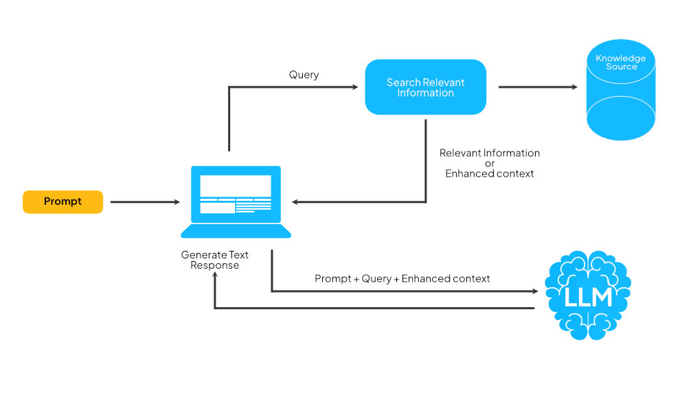
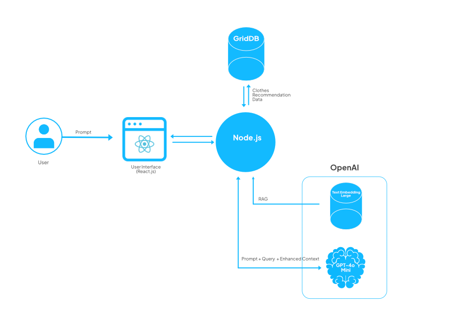
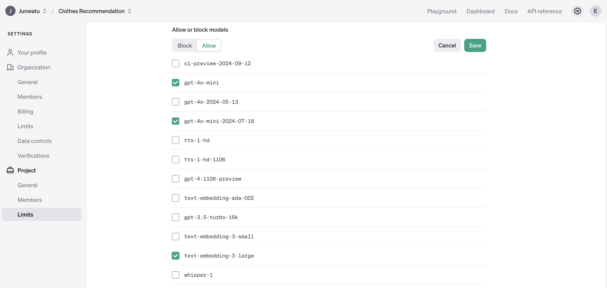

# Clothes Recommendation System Using OpenAI & RAG


## Table of Contents

- [Clothes Recommendation System Using OpenAI \& RAG](#clothes-recommendation-system-using-openai--rag)
  - [Introduction](#introduction)
  - [Understanding Retrieval-Augmented Generation (RAG)](#understanding-retrieval-augmented-generation-rag)
  - [How Does RAG Work?](#how-does-rag-work)
  - [Advantages of OpenAI \& RAG in Fashion](#advantages-of-openai--rag-in-fashion)
  - [System Architecture](#system-architecture)
  - [Prerequisites](#prerequisites)
    - [OpenAI](#openai)
    - [Docker](#docker)
    - [Node.js](#nodejs)
  - [Run The Project](#run-the-project)
  - [Node.js Backend](#nodejs-backend)
  - [Data Management with GridDB](#data-management-with-griddb)
  - [Building User Interface](#building-user-interface)
  - [Demo](#demo)
  - [Further Enhancements](#further-enhancements)

## **Introduction**

Clothes recommendation is an important feature in any e-commerce solution. It gives personalized shopping experiences in fashion and by using AI-driven solutions will enhance that experiences.

In this article, we will use the GPT-4o mini model to analyzing images of clothing and extract it's colors and styles. With these information we can acurrately identify the characteristic of the input clothing item and complement the identified features with our knowledge base using RAG technique.

## **Understanding Retrieval-Augmented Generation (RAG)**

Retrieval-Augmented Generation (RAG) enhances large language models (LLMs) by using external knowledge bases for more accurate responses. LLMs, trained on vast data with billions of parameters, perform tasks like answering questions or translations. RAG improves this by enabling the model to access specific domains or internal data without retraining.

## How Does RAG Work?

Without RAG, the LLM takes the user input and creates a response based on information it was trained on—or what it already knows.

With RAG, an information retrieval component is introduced that utilizes the user input to first pull information from a new knowledge source. The user query and the relevant information are both given to the LLM. The LLM uses the new knowledge and its training data to generate a better text responses.



## **Advantages of OpenAI & RAG in Fashion**

Combining GPT-4o mini with Retrieval-Augmented Generation (RAG) offers several practical benefits for the fashion industry:

1. **Contextual Understanding**: GPT-4o mini analyzes clothing inputs and comprehends their context, leading to more accurate responses.

2. **Access to Information**: RAG integrates the generative abilities of GPT-4o mini with a retrieval system that draws from a large database of fashion-related knowledge, ensuring relevant information is readily available.
3. **Personalization**: The system can provide tailored recommendations based on user preferences and historical data, enhancing the shopping experience.

## **System Architecture**



This system architecture leverages **RAG** to ensure that the recommendations are informed by both **user-specific input** and **stored data**, making them more relevant and customized.

Here’s a breakdown of the components and their interactions:

**User Interaction**:

- The user inputs a **prompt** (e.g., their preferences or requirements for clothing) through a **React.js** based **User Interface**.
- This UI serves as the point where the user communicates with the system, sending prompts and receiving recommendations.

**Node.js Backend**:

- The **Node.js** server acts as the core processing unit, handling communication between the user interface, database, and OpenAI services.
- It receives the user's prompt from the React.js front end and processes it to determine the data and insights required for a recommendation.

**Data Source (GridDB)**:

- **GridDB** is used to store **clothing recommendation data** such as item descriptions, styles, weather conditions, user preferences, and more.

**RAG Integration with OpenAI**:

- In this system, the Node.js server uses RAG to provide **enhanced context** by combining information fetched from **Text Embedded Model** with the user’s prompt before passing it to **OpenAI**.

**OpenAI (Text Embedding + GPT-4.0 Mini)**:

- The **Text Embedding** model is used to generate vector representations of the prompt and any retrieved context, making it easier to match user queries with relevant data.
- **GPT-4.0 Mini** (a smaller variant of GPT-4) processes the **prompt, query, and enhanced context** together to generate tailored recommendations.
- This step enables the system to provide more personalized and context-aware recommendations based on both user input and the data fetched from GridDB.

**Response Flow**:

- After generating the recommendation, the response is sent back through the Node.js backend to the **React.js** user interface, where the user can view the clothing suggestions.

## **Prerequisites**

### OpenAI

There few steps needed to setup in OpenAI. Go to your project dashboard and do these steps:

1. You need to enable two models from OpenAI:

    - gpt-4o-mini
    - text-embedding-3-large

    

2. You also need to create a key. It will be used by the app so it can use those models:

    

    And use the key in the `.env` file.

### Docker

For easy development and distribution, this project using docker container to "package" the application. For easy Docker instalation, use the [Docker Desktop](https://www.docker.com/products/docker-desktop/) tool.

#### GridDB Docker

This app need a GridDB server and should be running before the app. In this project we will use the GridDB docker for ARM machine.  For instructions on how to install it, please check out this [blog](https://griddb.net/en/blog/griddb-on-arm-with-docker/).


### Node.js

> This is needed for the project development. However, if you just want to [run the project](#run-the-project), you dont have to install it.

Install Node.js from [here](https://nodejs.org/en/download). For this project, we will use the `nvm` package manager and Node.js v16.20.2
LTS version.

```shell
# installs nvm (Node Version Manager)
curl -o- https://raw.githubusercontent.com/nvm-sh/nvm/v0.39.7/install.sh | bash

# download and install Node.js
nvm install 16

# verifies the right Node.js version is in the environment
node -v # should print `v16.20.2`

# verifies the right NPM version is in the environment
npm -v # should print `8.19.4``
```

To connect Node.js and GridDB database, you need the [gridb-node-api](https://github.com/nodejs/node-addon-api) npm package which is a Node.js binding developed using GridDB C Client and Node addon API.

## Run The Project

### 1. Check the GridDB

Make sure the GridDB docker is running. To check it, you can use this command:

```shell
# Check container status
docker ps | grep griddb-server
```

If the GridDB is running, you will have a simillar response to this:

```shell
fcace9e13b5f   griddbnet/griddb:arm-5.5.0      "/bin/bash /start-gr…"   3 weeks ago   Up 20 hours   0.0.0.0:10001->10001/tcp   griddb-server
```

### 2. Clone the App

Clone the app source code from this [repository](https://github.com/junwatu/clothes-recommendation):

```shell
git clone https://github.com/junwatu/clothes-recommendation.git
```

Change directory into the `app` folder and dockerize the app:

```shell
cd app
docker build -t nodejs-clothes-recommendation .
```

### 3. Run Docker

Run the docker app using this command (you need to adjust the GridDB clustername, username, and password if these has different values):

```shell
docker run --name clothes-rag-griddb --network griddb-net -e GRIDDB_CLUSTER_NAME=myCluster -e GRIDDB_USERNAME=admin -e GRIDDB_PASSWORD=admin -e IP_NOTIFICATION_MEMBER=griddb-server:10001 -p 3000:3000 nodejs-clothes-recommendation
```

Also, by using the Docker Desktop you can easily check if the GridDB and the docker app is running or not.


## **Node.js Backend**

This app use Node.js as the backend server. It serve user interface files and process the recommendation for the selected product.


## **Data Management with GridDB**

## **Building User Interface**

## **Demo**

## **Further Enhancements**
