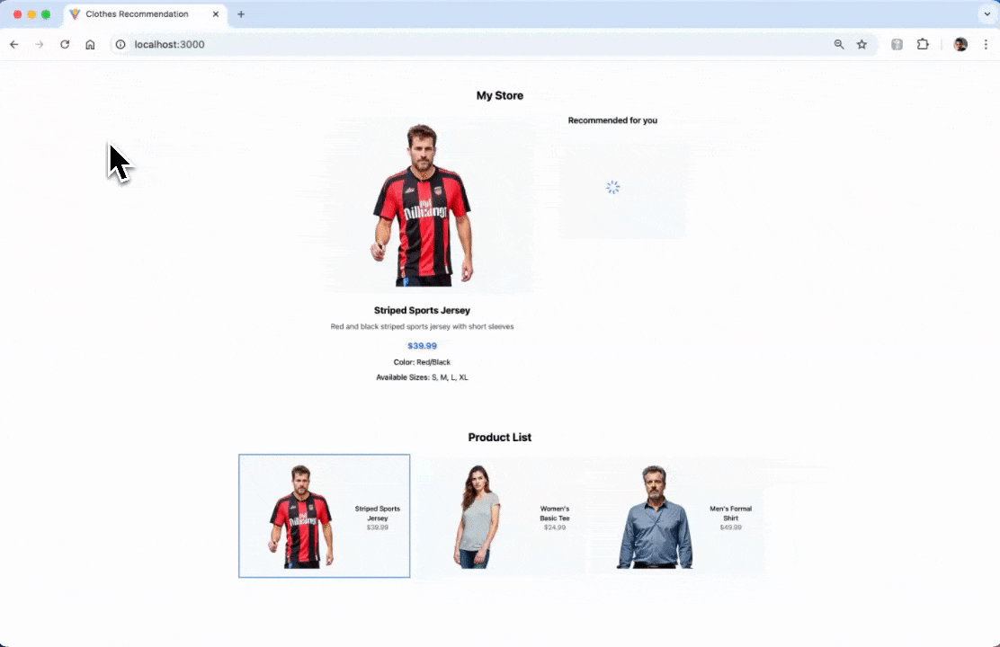
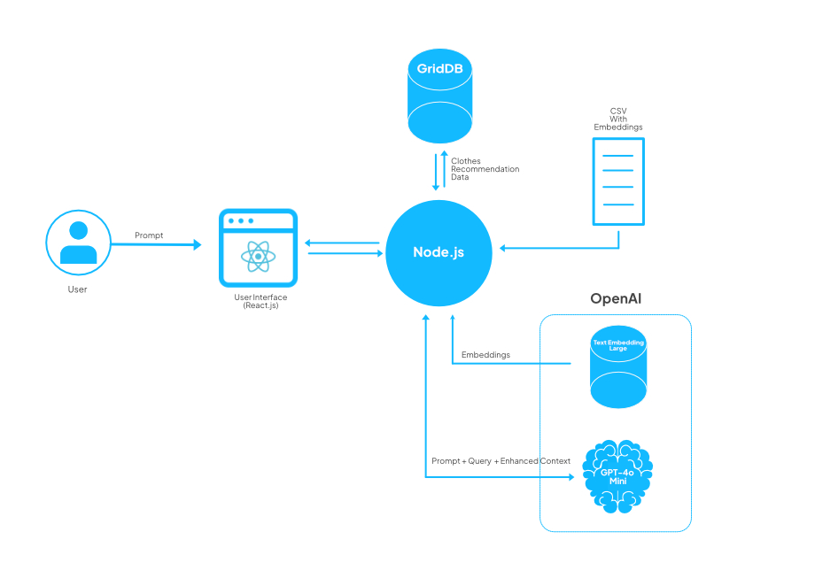
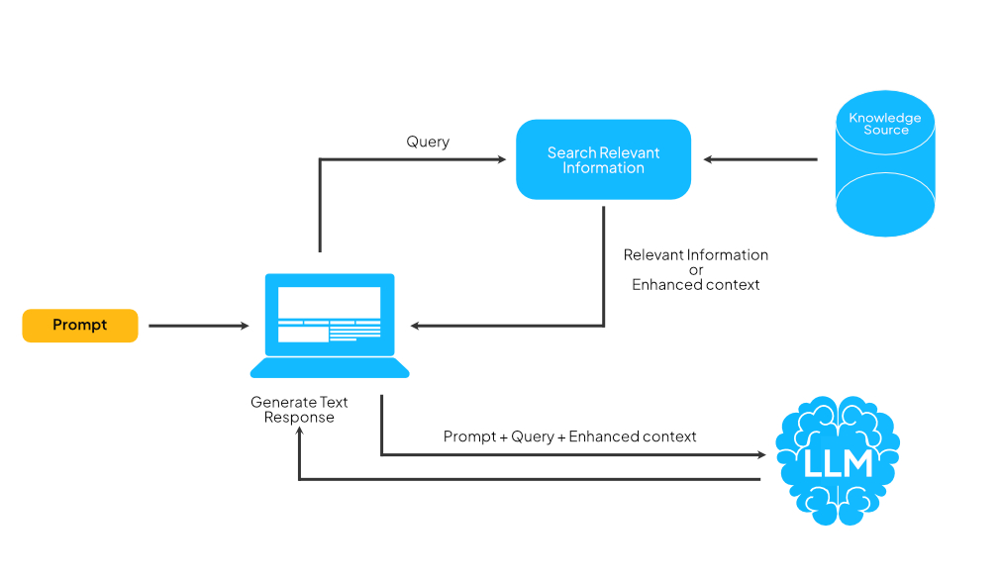

# Clothes Recommendation System Using OpenAI & RAG


## Table of Contents

- [Clothes Recommendation System Using OpenAI \& RAG](#clothes-recommendation-system-using-openai--rag)
  - [Introduction](#introduction)
  - [System Architecture](#system-architecture)
  - [Running The Project](#running-the-project)
  - [Understanding Retrieval-Augmented Generation (RAG)](#understanding-retrieval-augmented-generation-rag)
  - [How Does RAG Work?](#how-does-rag-work)
  - [Advantages of OpenAI \& RAG in Fashion](#advantages-of-openai--rag-in-fashion)
  - [Prerequisites](#prerequisites)
    - [OpenAI](#openai)
    - [Docker](#docker)
    - [Node.js](#nodejs)
  - [Project Development](#project-development)  
  - [Node.js Backend](#nodejs-backend)
  - [Data Management with GridDB](#data-management-with-griddb)
  - [Building User Interface](#building-user-interface)
  - [Further Enhancements](#further-enhancements)

## **Introduction**

Clothes recommendation is an important feature in any e-commerce solution. It gives personalized shopping experiences in fashion and using AI-driven solutions will enhance those experiences.

In this article, we will use the GPT-4o mini model to analyze images of clothing and extract its colors and styles. With this information, we can accurately identify the characteristics of the input clothing item and complement the identified features with our knowledge base using the RAG technique.

## Running The Project

This app is tested on ARM Machines such as Apple MacBook M1 or M2 and to run the project you need [Docker](#docker) installed.

### 1. `.env` Setup

Create an empty directory, for example, `clothes-rag`, and change to that directory:

```shell
mkdir clothes-rag
cd clothes-rag
```

Create a `.env` file with these keys:

```ini
OPENAI_API_KEY=
GRIDDB_CLUSTER_NAME=myCluster
GRIDDB_USERNAME=admin
GRIDDB_PASSWORD=admin
IP_NOTIFICATION_MEMBER=griddb-server:10001
```

To get the `OPENAI_API_KEY` please read this tutorial [section](#openai).

### 2. Run with Docker Compose

Create the `docker-compose.yml` file in the directory and use this setup configuration:

```yml
networks:
  griddb-net:
    driver: bridge

services:
  griddb-server:
    image: griddbnet/griddb:arm-5.5.0
    container_name: griddb-server
    environment:
      - GRIDDB_CLUSTER_NAME=${GRIDDB_CLUSTER_NAME}
      - GRIDDB_PASSWORD=${GRIDDB_PASSWORD}
      - GRIDDB_USERNAME=${GRIDDB_USERNAME}
      - NOTIFICATION_MEMBER=1
      - IP_NOTIFICATION_MEMBER=${IP_NOTIFICATION_MEMBER}
    networks:
      - griddb-net
    ports:
      - "10001:10001" # Expose GridDB port if needed for external access

  clothes-rag:
    image: junwatu/clothes-rag:latest
    container_name: clothes-rag-griddb
    env_file: .env  # Load environment variables from the single .env file
    networks:
      - griddb-net
    ports:
      - "3000:3000" # Expose application port for local access
```

### 3. Run

When steps 1 and 2 are finished, run the app with this command:

```shell
docker-compose up -d
```

If everything running, you will get a similar response to this:

```shell
[+] Running 3/3
 ✔ Network clotes-rag-griddb_griddb-net  Created                     0.0s 
 ✔ Container griddb-server               Started                     0.2s 
 ✔ Container clothes-rag-griddb          Started                     0.2s 
```

### 4. Test the App

Open the browser and go to `http://localhost:3000`. By default the app will automatically make a request for the default selected product.



If you want to run the project locally from the app source code, please read this [section](#project-development).

## **System Architecture**

This system architecture leverages **RAG** to ensure that the recommendations are informed by both **user-specific input** and **stored data**, making them more relevant and customized.



Here’s a breakdown of the components and their interactions:

**User Interaction**:

- The user inputs a **prompt** (e.g., their preferences or requirements for clothing) through a **React.js** based **User Interface**.
- This UI serves as the point where the user communicates with the system, sending prompts and receiving recommendations.

**Node.js Backend**:

- The **Node.js** server acts as the core processing unit, handling communication between the user interface, database, and OpenAI services.
- It receives the user's prompt from the React.js front end and processes it to determine the data and insights required for a recommendation.

**Data Source (GridDB)**:

- **GridDB** is used to store **clothing recommendation data** such as selected clothes and recommendations.

**RAG Integration with OpenAI (Embeddings)**:

- In this system, the RAG use data from CSV with Embeddings data.

- The Node.js server uses RAG to provide **enhanced context** by combining information fetched from **Text Embedded Model**, data from CSV and the user’s prompt before passing it to **OpenAI**.

**OpenAI (Text Embedding + GPT-4.0 Mini)**:

- The **Text Embedding** model is used to generate vector representations of the prompt and any retrieved-context, making it easier to match user queries with relevant data.
- **GPT-4.0 Mini** (a smaller variant of GPT-4) processes the **prompt, query, and enhanced context** together to generate tailored recommendations.
- This step enables the system to provide more personalized and context-aware recommendations based on both user input and the data fetched from the CSV file.

**Response Flow**:

- After generating the recommendation, the response is sent back through the Node.js backend to the **React.js** user interface, where the user can view the clothing suggestions.

## **Understanding Retrieval-Augmented Generation (RAG)**

Retrieval-augmented generation (RAG) enhances large language models (LLMs) by using external knowledge bases for more accurate responses. LLMs, trained on vast data with billions of parameters, perform tasks like answering questions or translations. RAG improves this by enabling the model to access specific domains or internal data without retraining.

## How Does RAG Work?

Without RAG, the LLM takes the user input and creates a response based on the information it was trained on—or what it already knows.

With RAG, an information retrieval component is introduced that utilizes the user input to first pull information from a new knowledge source. The user query and the relevant information are both given to the LLM. The LLM uses the new knowledge and its training data to generate a better text response.



## **Advantages of OpenAI & RAG in Fashion**

Combining GPT-4o mini with Retrieval-Augmented Generation (RAG) offers several practical benefits for the fashion industry:

1. **Contextual Understanding**: GPT-4o mini analyzes clothing inputs and comprehends their context, leading to more accurate responses.

2. **Access to Information**: RAG integrates the generative abilities of GPT-4o mini with a retrieval system that draws from a large database of fashion-related knowledge, ensuring relevant information is readily available.
3. **Personalization**: The system can provide tailored recommendations based on user preferences and historical data, enhancing the shopping experience.

In this post, only points 1 and 2 are utilized for the project.

## **Prerequisites**

### OpenAI

There few steps needed to set up OpenAI. Go to your project dashboard and do these steps:

1. You need to enable two models from OpenAI:

    - gpt-4o-mini
    - text-embedding-3-large

    

2. You also need to create a key. It will be used by the app so it can use those models:

    

    Use the key for the value of `OPENAI_API_KEY` in the `.env` file and this file should be ignored from the repository.

### Docker

For easy development and distribution, this project uses a docker container to "package" the application. For easy Docker installation, use the [Docker Desktop](https://www.docker.com/products/docker-desktop/) tool.

#### GridDB Docker

This app needs a GridDB server and it should be running before the app. In this project, we will use the GridDB docker for ARM machines.  To test the GridDB on your local machine, you can run these docker commands:

```shell
docker network create griddb-net
docker pull griddbnet/griddb:arm-5.5.0
docker run --name griddb-server \
    --network griddb-net \
    -e GRIDDB_CLUSTER_NAME=myCluster \
    -e GRIDDB_PASSWORD=admin \
    -e NOTIFICATION_MEMBER=1 \
    -d -t griddbnet/griddb:arm-5.5.0
```

By using the Docker Desktop, you can easily check if the GridDB docker is running.


For more about GridDB docker for ARM, please check out this [blog](https://griddb.net/en/blog/griddb-on-arm-with-docker/).

### Node.js

> This is needed for the project development. However, if you just want to [run the project](#run-the-project), you don't have to install it.

Install Node.js from [here](https://nodejs.org/en/download). For this project, we will use the `nvm` package manager and Node.js v20.18.0
LTS version.

```shell
# installs nvm (Node Version Manager)
curl -o- https://raw.githubusercontent.com/nvm-sh/nvm/v0.39.7/install.sh | bash

# download and install Node.js
nvm install 20

# verifies the right Node.js version is in the environment
node -v # should print `v20.18.0`

# verifies the right NPM version is in the environment
npm -v `
```

To connect Node.js and GridDB database, you need the [gridb-node-api](https://github.com/nodejs/node-addon-api) npm package which is a Node.js binding developed using GridDB C Client and Node addon API.

## Project Development

If you want to develop the project, you need to do these few steps:

### 1. Check the GridDB

To make this app work as expected, make sure the GridDB docker is running. To check it, you can use this docker command:

```shell
# Check container status
docker ps | grep griddb-server
```

If the GridDB is running, you will have a similar response to this:

```shell
fcace9e13b5f   griddbnet/griddb:arm-5.5.0      "/bin/bash /start-gr…"   3 weeks ago   Up 20 hours   0.0.0.0:10001->10001/tcp   griddb-server
```

and if it's not running, please check this previous [section](#griddb-docker).

### 2. Clone the App Source Code

Clone the app source code from this [repository](https://github.com/junwatu/clothes-recommendation):

```shell
git clone https://github.com/junwatu/clothes-recommendation.git
```

The `app` folder is the source code for this app.

### 3. Build the App Docker

Change the directory into the `app` folder and build the app docker version:

```shell
cd app
docker build -t clothes-rag .
```

### 4. Run the App Docker

Before running the dockerize app, you need to setup a few enviroment keys. You can copy these keys from the `.env.example` file or create an `.env` file and fill with these keys:

```shell
OPENAI_API_KEY=
GRIDDB_CLUSTER_NAME=myCluster
GRIDDB_USERNAME=admin
GRIDDB_PASSWORD=admin
IP_NOTIFICATION_MEMBER=griddb-server:10001
```

Make sure you have the key to access the OpenAI service. For details on how to do this, read the previous [section](#openai).

The last one is run the app docker using this command:

```shell
docker run --name clothes-rag-griddb \
    --network griddb-net \
    --env-file .env \
    -p 3000:3000 clothes-rag
```

Also, by using the Docker Desktop you can easily check if the GridDB and the dockerize app are running or not.


From the screenshot above the GridDB is running on port 10001 and the app is runnning on port 3000. Now, you can test the app using the browser.

## **Node.js Backend**

This app uses Node.js as the backend server. It serves user interface files and processes the AI recommendation for the selected product.

### API Documentation

| Route             | Method | Description                         |
|-------------------|--------|-------------------------------------|
| `/`               | `GET`  | Serves the main user interface file.          |
| `/recommendation` | `POST` | Generates clothing recommendations. |
| `/query`          | `GET`  | Retrieves stored data.          |
| `/query/:id`      | `GET`  | Retrieves data by a specific ID.    |

The core functionality for this app is in the `/recommendation` route. The `getClothRecommendations` function will take a selected product, which is essentially a product image, and it will return an array of product recommendations.

```js
const recommendationResults = await getClothRecommendations(realImagePath);
```

## **RAG**

### API Documentation

The RAG source code is in the `lib\rag.js` file. This file is responsible for getting the clothes recommendation.

| **Function Name**          | **Description**                                                                                                           |
|----------------------------|---------------------------------------------------------------------------------------------------------------------------|
| `analyzeCloth`             | Analyzes an image of clothing to suggest matching items, category, and gender.                         |
| `getEmbeddings`            | Generates embeddings for text descriptions, creating vector representations for similarity calculations.                  |
| `findSimilarItems`         | Finds items similar to an input item based on cosine similarity, filtering by threshold and top matches.                       |
| `getClothRecommendations`  | Generates recommendations for clothing items to pair with an input image, with retry for better matches.                |

The core functionality is handled by the `findSimilarItems` function which use the cosine similarity function to compare between 2 vector (clothes number representation).

```js
function cosineSimilarityManual(vec1, vec2) {
 vec1 = vec1.map(Number);
 vec2 = vec2.map(Number);
 const dotProduct = vec1.reduce((sum, v1, i) => sum + v1 * vec2[i], 0);
 const mag1 = Math.sqrt(vec1.reduce((sum, v) => sum + v * v, 0));
 const mag2 = Math.sqrt(vec2.reduce((sum, v) => sum + v * v, 0));
 return dotProduct / (mag1 * mag2);
}
```

If the vector result is tend to value 1 then the clothes is similar or recommended. You can set the minimum similarity score for clothes to be included.

In this code, the minimum threshold where the clothes are considered as a recommendation is `0.5`, you can change this to a higher value for stricter recommendations:

```js
function findSimilarItems(inputEmbedding, embeddings, threshold = 0.5, topK = 2) {
 const similarities = embeddings.map((vec, index) =>
  [index, cosineSimilarityManual(inputEmbedding, vec)]
 );
 const filteredSimilarities = similarities.filter(([, sim]) => sim >= threshold);
 const sortedIndices = filteredSimilarities
  .sort((a, b) => b[1] - a[1])
  .slice(0, topK);
 return sortedIndices;
}
```

### Data Source

The RAG data source uses a clothes style CSV file that contain embeddings values and from it the app get all the clothes recommendation.

You can look at all the clothes style databases in the `data\clothes_styles_with_embeddings.csv` file.

## **Data Management with GridDB**

### API Documentation

The main code that responsible for handling data input and output to GridDB is the `db/griddbOperarions.js` file. Here's the table summary for its function:

| **Function**                    | **Description**                                                                                               |
|----------------------------------|---------------------------------------------------------------------------------------------------------------|
| `getOrCreateContainer`           | Creates a new container or retrieves an existing one based on the specified container name and column info.  |
| `insertData`                     | Inserts data into the specified container and logs the operation.                                             |
| `queryData`                      | Executes a query on the specified container and fetches the results, logging the number of rows retrieved.   |
| `queryDataById`                 | Queries a container for a specific row identified by a unique ID, returning the corresponding row data.      |

The GridDB database can be used to save data as a collection or simply behave like a column base database.

This function will use the existing container or create a new one:

```js
export async function getOrCreateContainer(containerName, columnInfoList, rowKey = true) {
 try {
  const conInfo = new griddb.ContainerInfo({
   'name': containerName,
   'columnInfoList': columnInfoList,
   'type': griddb.ContainerType.COLLECTION,
   'rowKey': rowKey
  });

  await store.dropContainer(containerName).catch(() => console.log("Container doesn't exist. Creating new one..."));
  let container = await store.putContainer(conInfo, false);
  return container;
 } catch (err) {
  console.error("Error creating container:", err.message);
  throw err;
 }
}
```

In the `getOrCreateContainer` function the `type` container info key should be set as `griddb.ContainerType.COLLECTION`.

### Save Data

The data model for this app contains 3 data only: `id`, `image`, and `recommendations`:

```js
const columnInfoList = [
 ['id', griddb.Type.INTEGER],
 ['image', griddb.Type.STRING],
 ['recommendations', griddb.Type.STRING]
];
```

The recommendation data will be saved after successful response from OpenAI and this will be handled in the route `/recommendation`:

```js
const container = await getOrCreateContainer(containerName, columnInfoList);
  await insertData(container, [generateRandomID(), product.image, JSON.stringify(cleanRecommendations)]);
```

### Read Data

To read data in the GridDB database, you can directly use the `/query` route.

## **Building User Interface**

The user interface is built using the React library. The main user interface is built only with 2 react components:

### `ProductSelector.tsx`

This component shows all the clothes products. For simplicity, the product list data is from static data:

```js
const products: Product[] = [
    {
      id: 1,
      name: "Striped Sports Jersey",
      description: "Red and black striped sports jersey with short sleeves",
      price: 39.99,
      color: "Red/Black",
      size: ["S", "M", "L", "XL"],
      category: "Sports Wear",
      image: "/data/preview/1.png",
      thumbnail: "data/preview/1-small.jpeg",
    },
     //...
  ];
  ```

  When user select one clothes from the product list, the thumbnail will sent to the server for processing and the server will find recommendations.

  

### `RecommendationCard.tsx`

This component will display any recommendation for the selected product.


## **Further Enhancements**

To improve this product recommendation app, consider these five enhancements:

- Personalize Recommendations with User Profiles.
- Dynamic Product Catalog with Real-Time Database Integration.
- Optimize Data Retrieval with Incremental Caching.  
- Improve Recommendation Algorithm.  
- UI and UX Enhancements.
  
